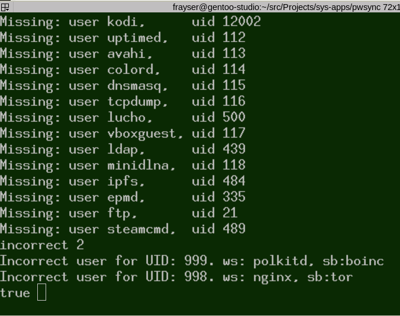

# pwsync
Synchronize /etc/passwd between two hosts

## Status
Currently loading pw_sync and running 'run' demostrates the passwords being read and compared.
1. The program reports missing users and corersponding uids.
2. It also reports UIDs and user names where the UIDS are incorrect for the specified uder.

## Usage
The source layout is setup up for doing an analysis of two passwords files.
The default files are the /etc/passwd from a host mounted at /usr/ghost, and
/etc/passwd of the current system--see pw_sync.pl to see where this is determined.

To run, load prolog. Consult pw_sync.pl.  Run the goal 'run.'
The run produces a report.

## Strategy for updating /etc/passwd.
(this is not yet implimented)

1. Get a list of all files belong to the current host. The list must contain file ownerships.
   find   / /usr /var /srv -fprintf /etc/perms.new "%04m %14u %14g %p\n"
   mv -b /etc/perms{,.bak}

2. Find users and groups the have the same meaning but different names on the two  hosts.
   Create rules translate betwee the two naming conventions.

3. Run the annalysis and take action.
   Place the control (ideal) passw and group file on the new/current system (system must be halted.)
   Replace the items having the same function but diffent names with the names used on the new system.
   Add any missing users and groups to future prof the new system.

4. Use the ownerships in  /etc/perms (or perms.new) to reassign the user and group ownenership of filysystem objects.
